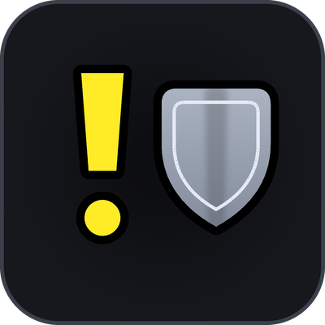

# Tank Tools

Marks enemy nameplates by threat, for tanks in retail WoW. Standalone: no
dependencies, no embedded libraries, works on the default UI.

<br clear="left">

## What it does

Two questions, answered as fast as possible.

**Which enemy is on someone else, so I can taunt it off?**

A bright **`!`** appears next to the nameplate of every enemy you do **not**
have aggro on. Nothing on screen means everything is yours. There is no threat
meter, no list, no percentages — see
[Secret values](#secret-values-midnight-and-later) for why those cannot work
inside an instance, and why none of them is what a tank acts on anyway.

**How many stacks does the other tank have, and is it my turn?**

A small panel puts you and your co-tanks side by side — health, boss debuffs
with their stack counts, and a ring around whoever is currently holding the
boss. The debuffs are drawn by the game's own aura display, which is what keeps
them on screen inside an encounter. See [The co-tank panel](#the-co-tank-panel).

Both are optional and independent; turn either off and the other is untouched.

## The three markers

Three independent markers, one per threat state, each with its own symbol:

| Marker | State | Default symbol | On by default |
|---|---|---|---|
| **Not mine** | you do **not** have aggro | `!` | yes |
| **At risk** | yours, but you are holding it insecurely | `?` | no |
| **Mine** | you **do** have aggro | `o` | no |

**Not mine** is the taunt list. **At risk** warns you before a mob becomes one.
**Mine** inverts the usual signal: instead of "something appeared, go get it",
it is a running confirmation that a plate is yours. Turn it on if you would
rather read a positive mark than an absence — some people find "nothing there"
hard to trust mid-pull. It gets its own quieter color (grey by default) and it
**never pulses**, so motion stays reserved for the two states that need you.

When a mob that *was* yours stops being yours, a raid-warning sound plays. That
is the one non-visual channel, and it fires in the moment you are looking at
health bars rather than nameplates.

## Why a glyph and not a color

Threat UI across WoW — Blizzard's and most addons' alike — leans almost
entirely on **red vs. green**, which is precisely the pair protanopia and
deuteranopia collapse into the same muddy tone. Roughly 1 in 12 men has some
form of color vision deficiency.

So the marker carries **no color information at all**:

| Channel | How it signals |
|---|---|
| **Shape** | a glyph with a distinct silhouette (`!`) |
| **Presence** | it appears *only* on mobs you have lost — nothing on screen means everything is yours |
| **Motion** | an optional pulse, a channel completely independent of hue |
| **Contrast** | thick black outline, so it reads over any nameplate color |

Every one of those survives being rendered in pure grayscale. Color is
decoration applied last — turn the monitor monochrome and the marker still
works perfectly. Every state is a differently *shaped* glyph, never a recolored
one, so no two ever rely on being told apart by hue.

## The co-tank panel

> **Not finished, and hidden.** The panel is behind a feature flag and is off
> for everyone. Turn it on in **`/tt features`** and reload. Nothing else in
> the addon mentions it: no commands in the help, no tab in the settings
> window, no lines in `/tt status`, and its module is never started. See
> [Features in progress](#features-in-progress).


You and every other tank in the group -- health, debuffs, and
which of you is actually holding the boss.

```
  side by side                        stacked

  Tankadin      94%   Bearbutt  81%   Tankadin      94%
  ##########>..[7][2] #######...[3]   ##########>..[7][2]
               ^ drawn by the        Bearbutt      81%
                 game, nearest        #######......[3]
                 the bar first
```

- **Debuffs are drawn by the game's own aura display.** That is what lets them
  keep working in a boss fight: since Midnight the client refuses to let an
  addon enumerate auras during an encounter or a Mythic+, so the panel hands a
  unit and a filter to the client's aura widget and lets it draw. Tank Tools
  never learns what the debuff is, and does not need to.
- **A boss/role filter you can turn on**, off by default. The client's display
  sorts by time remaining and cannot be asked for "biggest stack first", so the
  filter is the only way to stop procs crowding the tank debuff off the end of a
  five-icon row. It ships off anyway, because the engine never reports what it
  dropped -- a filter that matches nothing looks exactly like a tank with no
  debuffs, and showing too much is recoverable by looking while showing nothing
  is not. DBM ships its equivalent off for the same reason.
- **Tanks sit side by side or stacked**, your choice — a row across the top of
  the screen, or a column down the side.
- **Debuffs sit left or right of the bar**, also your choice. They are laid out
  outward from the bar either way, so the icon you watch does not move when you
  flip the side.
- **A ring marks whoever is holding a boss.** `UnitThreatSituation` against
  `boss1`-`boss5` stays readable inside an instance, so this keeps working where
  most threat UI cannot. The signal is the ring *being there*, not its colour.
- **Hover an icon for its tooltip**, the same as any other debuff — the client's
  display supplies it, which is the only way to get one for an aura the addon
  is not allowed to identify. `/tt twtips` turns it off if you would rather the
  icons not take the mouse at all.
- Absorbs draw on top of the health fill, never past it -- a shielded tank at
  40% is not a tank at 60%.

It hides itself below two tanks in the group. `/tt twtest` fills it with three
copies of you so you can place and size it solo, and `/tt twlock` puts the drag
handle away.

`/tt twsolo` turns on a second exception: inside a five-man, show the panel even
though you are the only tank. A dungeon is the cheap place to find out what the
client will actually hand over -- your own bar goes through the same reads and
the same setters a co-tank's does in a raid, so debuffs that render on you there
will render on them when it matters. It applies to party instances only, so the
panel does not follow you into the open world or a battleground.

### Why it survives Midnight

Health, names and absorbs go into a frame setter **unread** -- `SetText`,
`SetValue` and `SetMinMaxValues` all accept a secret value, so the bar fills
correctly without the addon knowing what the numbers are. Three things
genuinely need arithmetic, and each degrades on its own:

| Needs a real value | Without one |
|---|---|
| the `94%` text | blank |
| the absorb overlay | absent |
| class-coloured names | white |

**Auras are not like that, and assuming they were is why this panel used to go
blank.** The first version read debuffs the same way it reads health -- walk the
aura indices, hand each field to a setter unread -- on the assumption that a
restricted aura would arrive as a secret value. It does not. Inside an encounter
or a Mythic+ the client refuses the *enumeration itself*: the call throws, and
there is no value to launder. Three throws in a row latched the whole panel off,
which is exactly what "no debuff icons across two boss fights" was.

So the addon no longer reads auras at all. An `AuraContainer` -- the client's own
aura display, the same widget DBM uses for its tank and co-tank icons -- is told
which unit and which filter, and draws into regions the addon owns: a texture, a
cooldown, a font string for the stack count. The count on screen is real and the
addon never saw it.

Two things are given up for that, and neither is worked around:

| Lost | Why |
|---|---|
| sorting by stack count | the display sorts by time left, and takes no other order. The boss/role filter is the mitigation. |
| knowing how many icons are up | the addon is not told. `/tt cotanks` says so rather than printing a zero. |

On a client with no aura display widget the row falls back to reading auras
itself, sorting by stacks as before -- correct wherever it is allowed, and
silent rather than throwing where it is not.

**`/tt cotanks`** reports which of the two is running, and whether the
restriction is on right now:

```
aura engine=yes   auras restricted right now=yes
UnitInRaid(player)=nil  ->  we are drawn as player
raid2  name=Bearbutt
    health=81 / 100   absorbs=6
    class=DRUID  dead=false  connected=true
    debuffs: drawn by the game's aura engine (count not knowable, and does not need to be)
    direct read: denied -- the client refuses aura enumeration here
```

That last pair of lines is the whole diagnosis in one place: the read the addon
is no longer allowed to make, and the display that is drawing anyway.

## The debuff journal

*Unfinished, and behind a feature flag. `/tt features` turns it on; it takes
effect on the next `/reload`.*

The co-tank panel's debuff row cannot be told what to show. The aura engine
takes a list of spell ids to exclude and reports nothing back, so "always show
this one, never that one" needs a list of ids — and nobody has one. The journal
is how the list gets built: play, then read back what actually landed on you.

**`/tt debuffs`** opens it. One row per spell: the icon, the name, the id, the
dispel type, and whichever of the raid / boss / tank-role flags the client was
willing to hand over. Hovering a row gives the game's own spell tooltip,
description included, with what we know about it underneath. Filter by name or
by id, sort by recency, name, or how often you have seen it.

### Two doors, because one of them is shut where it matters

| | What it gives | Where it works |
|---|---|---|
| the aura data | spell id, name, icon, dispel type, raid / boss / tank-role flags | anywhere the client will let an addon read auras |
| the combat log | spell id, name | everywhere, including an encounter |

The rich door is the one that closes. Inside an encounter or a Mythic+ the
client refuses aura reads outright — exactly the content whose debuffs are
worth cataloguing — so the combat log is read as well. `SPELL_AURA_APPLIED`
carries a spell id and the word `DEBUFF`, and it is a log line rather than a
unit read: a different permission, and one that is still open. The rest of the
row comes from the spell database, because asking what spell 12345 is called is
not a question about a unit and is answerable in a boss fight like anywhere
else.

What the log cannot give is the flags. A record it produced alone is marked
**log only** rather than being drawn with five empty boxes, because "we never
got to look" and "no, none of those" are different answers and only one of them
is safe to act on. The same rule holds field by field: a flag read in a delve
is never overwritten by a raid where the client refused to say.

### What it costs

The combat log handler runs on every line of the log, which in a raid is
thousands a second. It rejects on the subevent first and compares a GUID only
for the handful of lines that survive that, and it can be switched off on its
own — **Also record from the combat log** — leaving the aura door open.
Recording as a whole is one checkbox too.

The journal holds four hundred debuffs and drops what you have not seen for
longest. It is saved per character, and **Forget everything recorded** (or
`/tt debuffs clear`) empties it.

### What is not built yet

Marking a debuff *tracked* or *ignored*, so the co-tank panel's row always
shows it whatever else is up, or never shows it at all. That is why the feature
is still behind a flag: the recording and the window work, and the thing they
exist to feed does not.

## Setup

Type **`/tt config`**, or go through **ESC → Options → AddOns → Tank Tools**.
Size, which side of the plate it sits on, the symbols, the colors, and whether
it pulses are all in there.

### Seeing what you are adjusting

Click **Preview marker on all nameplates** (or `/tt nptest`). Every enemy
nameplate is marked immediately, whether or not you have aggro on it — so you
can walk up to a target dummy, or stand in any outdoor zone, and tune size and
position against real nameplates.

Preview ignores every other condition on purpose: it works out of combat and on
any spec, because that is where you will be standing when you set it up. Each
enabled symbol is spread across the mobs on screen, and each nameplate keeps
the same one rather than flickering, so with all three on you can see `!`, `?`
and `o` side by side and check the silhouettes really are distinct at the size
you picked.

It is intentionally temporary. Preview is never saved, and it switches itself
off the moment you change zone — so it cannot follow you into a dungeon and
mark the whole pull.

## When things mark

A marker needs all of: you are in a tank spec, that marker's checkbox is on,
and the mob is in the matching threat state.

Markers deliberately ignore combat state. The moment you most need one is a
pull you did not start — and when someone else grabs a mob, you are by
definition not yet in combat yourself.

**Nothing is tracked** unless an enemy is actually fighting your group: it has
a threat entry for you or for a group member, or (outside an instance only) it
is swinging at one of you. Idle mobs in the room ahead never mark.

If nothing marks when you think it should, run **`/tt status`** — it prints
your spec, combat and instance state, every gate above, and how many mobs are
marked. For the per-mob answer, run **`/tt debug`** in the fight: it dumps
every nameplate the scan sees, every value it read, and the exact check that
rejected each one.

## Secret values (Midnight and later)

Since Midnight, the client returns **secret values** for anything that
identifies a unit while you are inside an instance. `UnitGUID` comes back a
secret string; `UnitIsUnit`, `UnitCanAttack` and `UnitName` can come back
secret too. A secret can be handed to a frame setter, but comparing it,
formatting it, or using it as a table key throws immediately.

That is why this addon is only a marker. A list needs names to print and
percentages to sort by, and inside a dungeon it fills with `Unknown`.

### The two threat APIs are not equally restricted

The single most important fact here, and easy to get wrong:

| Call | Inside an instance |
|---|---|
| `UnitThreatSituation(unit, mob)` | returns a plain, readable **0–3** |
| `UnitDetailedThreatSituation(unit, mob)` | returns **secret values** for nameplate pairings |

Tank Tools uses only the plain one, whose single number carries all three states:

| Status | Means | Marker |
|---|---|---|
| `nil` | no threat entry — not our fight yet | *none* |
| `0` / `1` | someone else holds it | **not mine** |
| `2` | ours, but insecurely | **at risk** |
| `3` | ours, securely | **mine** |

Status `2` *is* the at-risk warning, stated by the client itself — which is why
no threat-percentage threshold is needed to produce it, and why it keeps
working inside an instance.

### No unit identity at all

| Instead of | It uses |
|---|---|
| `UnitGUID` as a mob key | the unit token (`nameplate3`) |
| `UnitIsUnit` to drop our own raid token | `UnitInRaid("player")`, an integer index |
| `UnitIsUnit(unit, "player")` for the personal plate | `unit == "player"`, a plain string compare |
| `C_NamePlate.GetNamePlates()` + `namePlateUnitToken` | the `nameplate1`…`nameplate40` tokens |

That last one matters: plate frames no longer carry a `namePlateUnitToken`
field. It reads `nil`, and a scan built on it sees nothing at all — silently,
because a `nil` token merely fails an `if`.

Every remaining unit read goes through a `Clean()` helper built on
`issecretvalue`, which turns a restricted value into `nil` rather than letting
it reach a comparison. Identity predicates then **fail open**: an unreadable
`UnitCanAttack` lets the mob through rather than dropping it, because the
threat data does the real gating and you cannot hold threat on a friendly unit.
Failing closed is what blinds the addon in exactly the content it exists for.

### What this costs inside instances

One thing genuinely cannot be done there: asking a mob **who it is currently
hitting**. That question is `UnitIsUnit(mobTarget, groupMember)`, and it is
restricted.

Outdoors, that check catches a mob nobody has threat on yet — a freshly spawned
add that landed on the healer, or one a pet is holding. Inside an instance,
group threat entries are the only signal, so such a mob stays unmarked until
*someone* generates threat on it. In practice that is a global cooldown or
less, and once anyone has touched it the mob marks normally.

### The scan latch

The set of values the client treats as secret has grown across patches and can
grow again. Rather than throw an error five times a second forever if it does,
the scan runs under a latch: three consecutive errors and it stops, once,
printing the error to chat. Changing zone clears it and retries.

## Commands

The settings window covers everything below; these remain for people who prefer
typing, and for macros.

| Command | Effect |
|---|---|
| `/tt config` | **open the settings window** |
| `/tt` | list all commands |
| `/tt nptest` | preview the symbols on every enemy nameplate |
| `/tt status` | why is nothing marking? |
| `/tt debug` | dump every nameplate the scan sees, and why each was skipped |
| `/tt cotanks` | dump what every co-tank read returns, and how debuffs are being drawn |
| `/tt np` | toggle the "not mine" marker |
| `/tt npwarn` | toggle the "at risk" marker |
| `/tt npsecure` | toggle the "mine" marker |
| `/tt nppulse` | toggle the pulse |
| `/tt npsize <10-72>` | marker size |
| `/tt npanchor <pos>` | left / right / top / bottom |
| `/tt npglyph <text>` | "not mine" symbol (default `!`) |
| `/tt npwarnglyph <text>` | "at risk" symbol (default `?`) |
| `/tt npsecglyph <text>` | "mine" symbol (default `o`) |
| `/tt npcolor <name>` | alert color — white / yellow / cyan / magenta / orange / green / grey |
| `/tt npseccolor <name>` | aggro marker color, same presets |
| `/tt tw` | toggle the co-tank panel |
| `/tt twlock` | lock the panel and hide its drag handle |
| `/tt twtest` | show the panel with placeholder tanks |
| `/tt twsolo` | show the panel in dungeons when you are the only tank |
| `/tt twlayout <l>` | tanks side by side (`row`) or stacked (`column`) |
| `/tt twanchor <side>` | debuffs on the left / right of the bar |
| `/tt twtips` | toggle debuff tooltips on hover |
| `/tt debuffs` | open the debuff journal |
| `/tt debuffs clear` | forget every recorded debuff |
| `/tt sound` | toggle the lost-mob sound |
| `/tt tankonly` | toggle tank-spec-only |

The `/tt debuffs` rows exist only while the debuff journal's feature flag is
on. With it off they are not listed by `/tt` and do not dispatch -- see
[Features in progress](#features-in-progress).

## Compatibility

Tank Tools is self-contained. It has no required dependencies, embeds no
libraries, ships no custom media, and uses only documented Blizzard APIs
(`C_NamePlate`, the `nameplate1`…`nameplate40` unit tokens, and
`UnitThreatSituation`). It works as-is on the default UI.

It also composes with nameplate addons rather than competing with them. The
marker is a child frame of Blizzard's base nameplate container and never
touches the plate's own frames, so whatever is drawing your nameplates keeps
full ownership of them. Where those addons color plates by threat, this adds
the channel a hue cannot carry.

The settings window is built from core widget types and long-lived Blizzard
templates, so it renders correctly with or without a UI replacement loaded. If
your UI exposes a public skinning API, Tank Tools will use it to match your
theme; otherwise the window uses its own dark backdrop. Either way it needs no
setup.

## Performance notes

- Polls at 5 Hz, and only while something is eligible to mark. On a non-tank
  spec, or with every marker off, each tick is a few comparisons and nothing
  else.
- Group unit tokens (`party1`, `raid1`, …) are cached on roster change, and the
  `nameplate1`…`nameplate40` tokens are built once at load, so the scan does no
  string building at all.
- A hostile unit that is not fighting anybody is rejected before the roster
  walk, so a city full of nameplates costs one threat lookup each.
- One marker frame is allocated per *plate frame*, not per mob. Blizzard
  recycles a small fixed pool of plates, so a whole session allocates ~40.
- Markers only touch a frame on an actual state transition. In a big pull the
  steady state is a couple of comparisons per plate per tick.

## Development

```
tank-tools/
  TankTools/                  the addon itself -- this folder is what ships
    TankTools.toc            load order, and the only place it is written down
    Core/
      Namespace.lua          the namespace, the module registry, shared state
      Secret.lua             Clean / IsTrue / IsFalse -- every restricted read
      Events.lua             one event frame, dispatched in .toc order
      DB.lua                 saved variables, per-module, with migration
      State.lua              roster cache, role, combat and instance flags
      Ticker.lua             one OnUpdate, one failure latch per subscriber
      Commands.lua           slash registry, generated help, /tt status
      Features.lua           flags for modules that are not finished yet
    UI/
      Widgets.lua            checkbox, slider, segmented picker, swatches
      Options.lua            the settings window; modules register sections
      Features.lua           the /tt features window
    Modules/
      Threat.lua             the scan -- produces state, draws nothing
      Nameplates.lua         the markers themselves
      TankWatch.lua          the co-tank panel
  tests/                      loads the addon into real Lua 5.1, no WoW needed
  assets/                     logo + the script that renders it (not shipped)
  deploy.py                   copy into a live WoW install for testing
  release.py                  tag + GitHub release from the .toc version
  pkgmeta.yaml                tells CurseForge how to package the zip
  .github/workflows/          attaches the built zip to the GitHub release
```

Tooling is shared with the ChattyLittleNpc repos, so it behaves identically.

### Tests

```
pip install lupa
python tests/run.py                 # every suite, every scenario
python tests/run.py tankwatch       # one suite
python tests/run.py core:migrate    # one scenario
```

`tests/harness.lua` stubs `CreateFrame`, the `Unit*` calls, events and the
ticker, then loads every file the `.toc` lists, **in `.toc` order**. Nothing is
mocked out: what runs is the shipping code, in a real Lua 5.1 interpreter.

Scenarios set up a different world before the addon loads:

| Scenario | Sets up |
|---|---|
| `core:fresh` | a clean install |
| `core:migrate` | an existing v1 (flat) saved-variables table |
| `core:tabs` | a third module registering a settings page |
| `tankwatch:fresh` | a raid with three tanks, the co-tank flag set |
| `tankwatch:secret` | the same raid with **every identity read restricted** |
| `tankwatch:engine` | the same raid with an **aura display widget present and aura reads denied outright** -- a boss fight. The icons must be on screen and the addon must not have touched an aura API. |
| `debuffs:fresh` | the journal with **both doors open** -- aura reads allowed, so a record can carry every flag there is |
| `debuffs:secret` | the journal with **aura enumeration refused** -- the combat log has to keep it filling, and nothing may throw |

The last two are the important ones, and they model two *different*
restrictions. `WORLD.secretMode = true` makes every `Unit*` call return a secret
value; the suite then asserts the panel still renders, that health still reaches
the bar unread, and that only the documented things degrade.
`WORLD.aurasSecret = true` is harsher and closer to what a boss fight actually
does: the aura calls **throw**. Any code that walks aura indices fails the suite
outright, which is the regression that motivated the aura display in the first
place.

### How a module is put together

Core owns four things and nothing else: a database, a ticker, an event
dispatcher and a settings window. A module declares what it wants from each and
never reaches into another module. The point is that a broken or removed module
costs you that module and nothing more.

```lua
local M = ns.NewModule("mymodule", {
    defaults = { enabled = true },     -- lives at TankToolsDB.modules.mymodule
})

function M:OnInit()                    -- after self.db exists, before any event
    ns.RegisterTicker("mymodule", "watch", 0.2, Tick)
    ns.RegisterEvent("GROUP_ROSTER_UPDATE", Rebuild)
end

ns.RegisterCommand{ name = "mine", section = "other:", order = 30,
                    desc = "toggle it", handler = Toggle }

ns.RegisterStatusProvider(30, function(yn) ... end)

ns.RegisterOptionsSection{ page = "My Page", pageOrder = 20,
                           column = "left", order = 10, build = Build }
```

Registration is declarative and happens at load time; nothing *runs* until
`ADDON_LOADED` has resolved the database. The help text, `/tt status` and the
settings window are all generated from these registrations, so a feature that
exists is a feature that is listed.

The settings window grows a tab strip automatically once a second page is
registered -- with one page it would be chrome carrying no information.

### Threat state has consumers, not a hardcoded display

`Modules/Threat.lua` produces `ns.stateByUnit` and draws nothing. Anything that
wants to show it registers:

```lua
ns.RegisterThreatConsumer{
    wants   = function() return MarkersWanted(), previewMode end,
    updated = Redraw,
}
```

`wants` also decides whether the scan runs at all this tick, which is what
keeps the idle cost at a few comparisons. Its second return means "run even
outside a tank spec", which is what a preview mode needs.

### Features in progress

The addon ships as one folder, so a half-built module still loads, still
registers its commands, and still puts a tab in the settings window. That is
fine on a branch and wrong the moment it is tagged: someone finds the feature,
it misbehaves, and the bug report is about a thing that was never claimed to
work.

A flag makes the module invisible instead. It declares one, and marks
everything it registers with the same name:

```lua
ns.RegisterFeature{
    name    = "cotanks",
    title   = "Co-tank panel",
    default = false,
    desc    = "one or more lines, shown under the checkbox",
}

local M = ns.NewModule("tankwatch", { feature = "cotanks", defaults = { ... } })

ns.RegisterCommand{ name = "tw", feature = "cotanks", ... }
ns.RegisterStatusProvider(30, Report, "cotanks")
ns.RegisterOptionsSection{ page = "Co-tanks", feature = "cotanks", ... }
```

With the flag unset:

| | |
|---|---|
| `OnInit` / `OnEnable` | never called -- no ticker, no events, nothing running |
| its commands | not listed in the help, and dispatch as if unregistered |
| its settings page | dropped, and an empty tab goes with it |
| its status lines | not printed |
| its settings | still created and still defaulted |

The file stays in the `.toc`. That is the point: it is still compiled on every
load and its suite still runs, so a gated module cannot quietly rot.

**`/tt features`** is the window that sets the flags. It is registered
`hidden = true`, so it is the one command the generated help does not list --
this is a door for the author, not a beta programme. Flags are per character
and saved like any other setting.

A flag is read once, at load. Turning one on takes effect on the next
`/reload`, and the window says so. Enabling live would be easy -- call
`OnInit` -- but disabling live is not: a ticker cannot be unregistered and an
event handler cannot be taken back, and a switch that works in one direction
only is worse than one that is honest about needing a reload.

Unregistered names are **enabled**. Gating is opt-in, so deleting a
`RegisterFeature` call ships the feature even if a `feature = "..."` field is
left behind somewhere -- failing the other way would let a half-finished
cleanup hide a shipped feature, which is the expensive direction of that
mistake.

### Deploying to a live WoW install

```
python deploy.py
```

Lists every WoW version found under the configured root, asks which to use,
then replaces that install's `Interface/AddOns/TankTools`. Change `WOW_ROOT` at
the top of the script if your install lives elsewhere.

### Cutting a release

Bump `## Version:` in `TankTools/TankTools.toc`, commit, then:

```
python release.py                 # dry run -- prints what it would do
python release.py --create        # tag + GitHub release
python release.py --create --type beta
```

The tag drives everything downstream: GitHub Actions attaches
`TankTools-<tag>.zip` to the release, and once the CurseForge webhook is set up
(see `../curseforge-packaging-setup.md`) the tagged commit is packaged there
too. `v1.0.0` publishes as Release, `v1.0.0-beta` as Beta, `v1.0.0-alpha` as
Alpha.

**Not yet done:** this repo still needs its CurseForge webhook. Follow Step 3
of `../curseforge-packaging-setup.md` with this repo's project ID.

### A note on `.luarc.json`

`undefined-field` and `inject-field` are switched off deliberately. The Lua
language server types `CreateFrame()` as a generic frame regardless of the
type string passed to it, so every genuine `Slider`, `EditBox` and
`CheckButton` method (`SetMinMaxValues`, `SetAutoFocus`, `SetChecked`, ...)
reports as undefined, and every field stored on a frame reports as an illegal
injection. Both are unavoidable in addon code. Real problems -- undefined
globals, syntax errors, arity mismatches -- are still reported.
